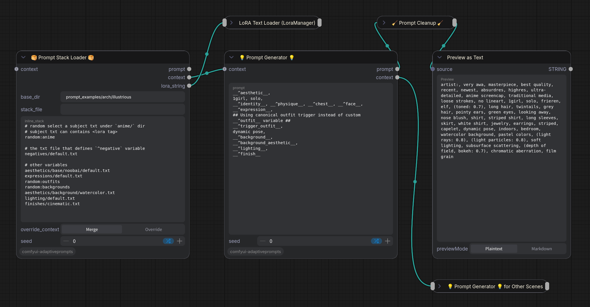

# Adaptive Prompts Extensions

This is a companion extension node for `comfyui-adaptiveprompts` that adds advanced, experimental, or specific workflow-related features to the core engine.

## 📦 Installation
If you are not using ComfyUI Manager (or if the node is not yet available in the Manager's registry), you can install this extension manually:

1. Open your terminal or command prompt.
2. Navigate to your ComfyUI `custom_nodes` directory:
   ```bash
   cd ComfyUI/custom_nodes/
   ```
3. Clone this repository:
   ```bash
   git clone https://github.com/your-username/comfyui-adaptiveprompts-extensions.git
   ```
4. Restart ComfyUI.

### Dependencies
This extension strictly depends on the core **Adaptive Prompts** engine. You **MUST** have the official `comfyui-adaptiveprompts` node installed in your `custom_nodes` folder for this extension to function.

## Nodes Included

## 🥞 Prompt Stack Loader


The **Prompt Stack Loader** is a powerful node designed to sequentially load, parse, and evaluate a stack of text files. Instead of constructing unwieldy monolithic prompt strings, it serves as an orchestrator for **modular prompt configurations** where your logic is distributed across multiple files.

### Why Use a Stack Loader?
By leveraging this node, you can transition your workflow into a highly adaptable **profile-based system**:
*   **Rapid Context Switching:** Easily switch between different subjects by changing a single line in your stack, automatically pulling in their associated LoRAs and custom styling.
*   **Dynamic Adaptation:** Your main Prompt Generator template dynamically adapts to the current subject, making the process seamless.
*   **Scalability:** The system is designed around a production-ready **Subject Hook Architecture**, allowing you to build complex, highly-detailed prompts cleanly and modularly. 

### Key Features
*   **Sequential File Processing:** Load and evaluate a list of text files (a "stack") in order. File paths can be absolute, relative, or specifically pull a random file from a directory.
*   **Dynamic Stack Modifiers:** Use inline commands like `remove:path/to/file.txt` or `replace:old_path|new_path` to surgically alter a master stack template without changing the underlying files.
*   **Automatic LoRA Tag Extraction:** Any `<lora:name:weight>` tags found within your stacked files are automatically extracted and compiled into a clean `lora_string` output to be sent directly to a LoRA Tag Loader.
*   **Context Accumulation & Overrides:** As files are processed, variables are collected into a `context` dictionary. You can pass context between multiple Stack Loaders, using the **Override** toggle to cleanly re-roll specific elements (like a character's expression) while keeping the rest of the generation state identical.

For a deeper dive into the **Architecture Philosophy** and ready-to-use template examples, please refer to the **[Real-World Example Stacks Documentation](prompt_examples/README.md)**.

A ready-to-use example workflow is also available: **[Prompt Stack Loader Three Scenes Pipeline](workflow/PromptStackLoaderThreeScenesPipeline.json)**.

### Node Parameters & Stack Syntax

- **`base_dir`**: The foundational directory for resolving file paths.
  - **Empty:** Resolves to the `prompts` directory within this extension's folder (`comfyui-adaptiveprompts/prompts/`).
  - **Relative Path:** Resolves relative to this extension's folder (e.g., `my_prompts` resolves to `comfyui-adaptiveprompts/my_prompts/`).
  - **Absolute Path:** Utilizes the absolute directory directly on your system.
- **`stack_file`**: The path to a `.txt` file containing your execution stack (e.g., `stacks/illustrious.txt`).
- **`inline_stack`**: A multiline text field used to define paths or apply on-the-fly overrides directly within the node.
- **`override_context`**: Determines how incoming context is handled: **Merge** (appends new variables) or **Override** (replaces existing variables).

> **Note on Paths:** All file paths specified within a `stack_file` or the `inline_stack` can be either absolute paths or relative paths. Relative paths are always resolved against your defined `base_dir`. Furthermore, path resolution is designed to be **cross-platform safe**, meaning your stacks and folder paths will work seamlessly across Windows, macOS, and Linux.

**Inline Stack Commands:**
Each line within a stack acts as an instruction. Alongside standard file paths, you can use the following commands to modify the stack dynamically right from the node:
- `random:folder_path` -> Selects a random `.txt` file from the specified directory (includes subfolders).
- `remove:file_path` -> Excludes a specific file from being loaded (e.g., `remove:styles/cyberpunk.txt`). Because LoRA tags are always accumulated across the stack and ignore the **Override** toggle, excluding the file that contains the LoRA is the primary way to prevent it from being merged into your final `lora_string` output.
- `replace:old_file|new_file` -> Swaps a file in-place, allowing targeted modifications without editing the original stack file. 
  - e.g., `replace:lighting/sunny.txt|lighting/rainy.txt` or `replace:random:anime|anime/frieren/frieren.txt`.

### Node Outputs

- **`prompt` (STRING):** The fully evaluated, comma-separated string containing all the text and resolved wildcards from the processed files, with LoRA tags stripped out.
- **`context` (DICT):** The accumulated dictionary of variables created during the evaluation of the stack. This can be passed to a Prompt Generator or another Stack Loader.
- **`lora_string` (STRING):** A clean string containing all `<lora:name:weight>` tags found across all files in the stack, ready to be passed to a LoRA Tag Loader.

